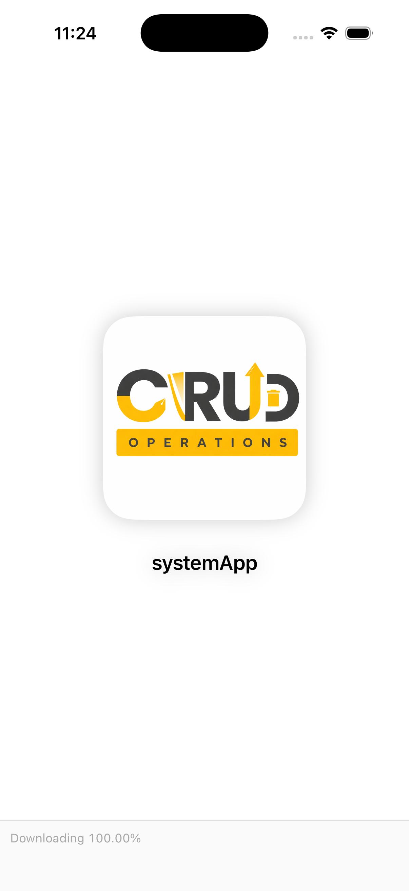
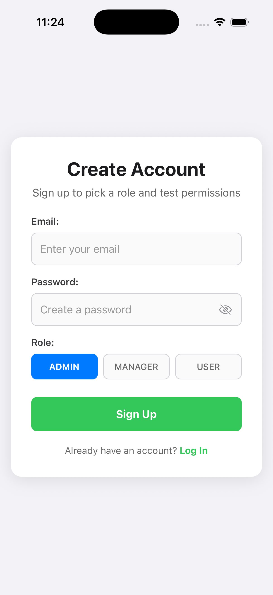
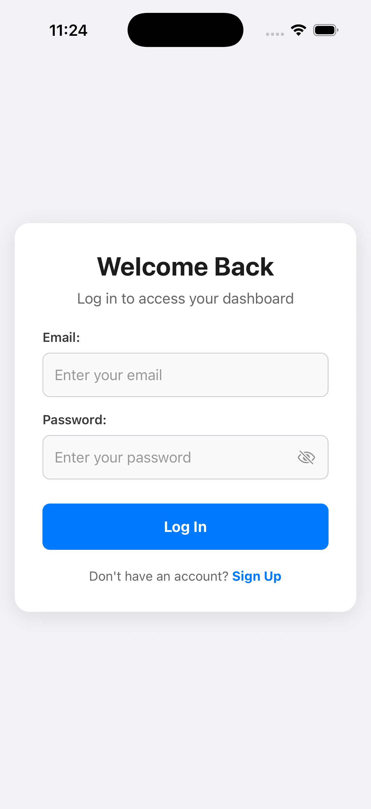
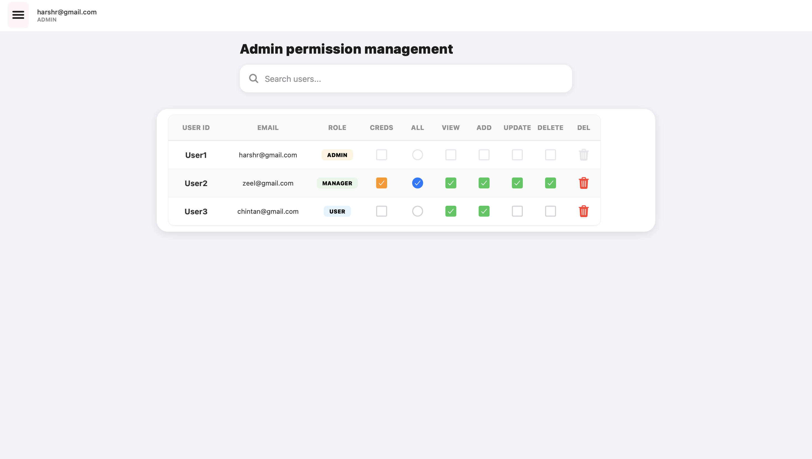
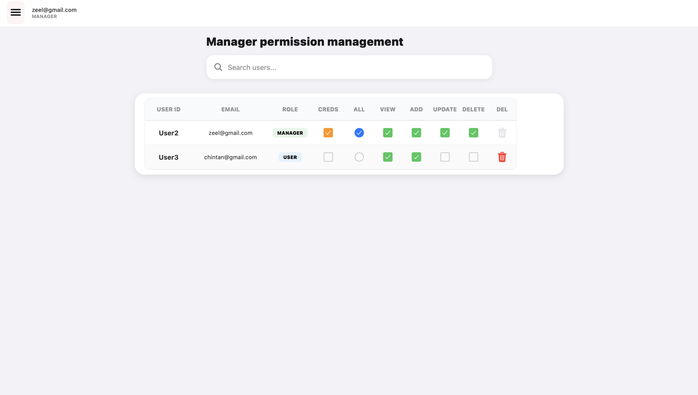
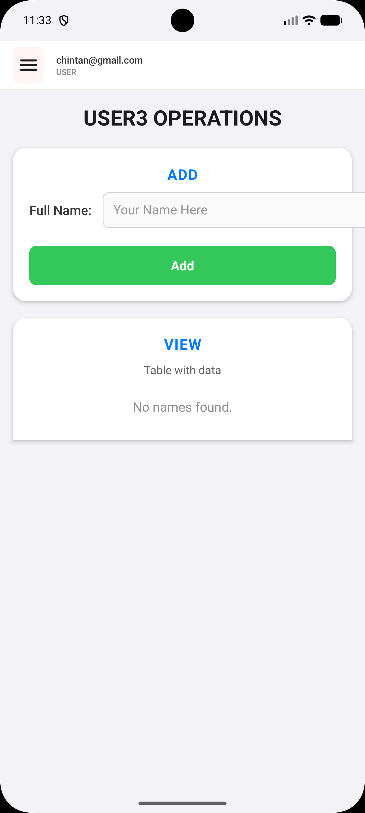
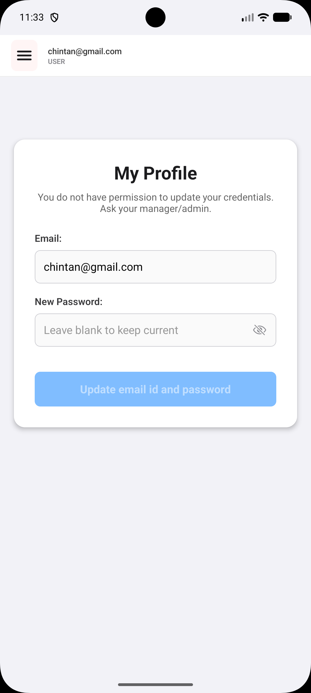

# Project Title

**systemApp — Template 3D Connections**

## Description

Role-based-access-control **system/permission management** mobile app built with **Expo Router** + **Firebase**.

This app includes authentication, role-based dashboards (Admin/Manager/User), permission-controlled CRUD screens, and Firebase Cloud Functions support for secure user deletion.

## Table of contents

- [Project Title](#project-title)
- [Description](#description)
- [Table of contents](#table-of-contents)
- [Features](#features)
- [Tech Stack](#tech-stack)
- [Tools](#tools)
- [Screenshots](#screenshots)
- [Image Files](#image-files)
- [App Preview](#ap_preview)
- [Installation](#installation)
- [Environment Variables](#environment-variables)
- [Folder Structure](#folder-structure)
- [Roles & Permissions](#roles--permissions)
- [Contribution](#contribution)
- [Author](#author)

## Features

- **Authentication**: Email/password sign up + login (Firebase Auth)
- **Roles**: `admin`, `manager`, `user`
- **Admin dashboard**:
  - Search users
  - Change roles
  - Toggle per-user permissions (view/add/update/delete)
  - Delete users via **Cloud Function** (Auth + Firestore)
- **Manager dashboard**: manager-focused UI (see `src/screens/ManagerDashboard.js`)
- **Permission-based CRUD**: regular users see a CRUD screen based on Firestore permissions (`src/components/CrudTemplate.js`)
- **Drawer navigation**: Dashboard / Profile / Logout

## Tech Stack

- **Expo** + **React Native** (New Architecture enabled)
- **expo-router** (file-based routing)
- **Firebase**
  - Auth
  - Firestore
  - Functions (callable)

## Tools

- **Node.js**: v18+ (Functions uses Node 20; see `functions/package.json`)
- **npm**
- **Expo CLI**: `npx expo ...`
- **Firebase CLI** (for functions deploy): `npx firebase ...`
- **EAS CLI** (optional builds): `npx eas ...`

##Screenshorts

Add your screenshots inside the following folder:

<pre> ```bash assets/images/ ``` </pre>

##Image Files

Make sure you include these images:

- splash.png
- signup.png
- signin.png
- admin_dashboard.png
- manager_dashboard.png
- user_dashboard.png
- profile.png

##App Preview









## Installation

1. Install dependencies:

```bash
npm install
```

2. Start the app:

```bash
npm run start
```

3. Run on device/emulator:

```bash
# Android
npm run android

# iOS (macOS only)
npm run ios

# Web
npm run web
```

## Environment Variables

This repo currently uses Firebase config directly in `firebaseConfig.js`.

- **Recommended for public GitHub**: move Firebase config to environment variables (or Expo config) and do not commit real production keys/project ids.

If you migrate to env-based config, you can use a `.env` like:

```env
EXPO_PUBLIC_FIREBASE_API_KEY=...
EXPO_PUBLIC_FIREBASE_AUTH_DOMAIN=...
EXPO_PUBLIC_FIREBASE_PROJECT_ID=...
EXPO_PUBLIC_FIREBASE_STORAGE_BUCKET=...
EXPO_PUBLIC_FIREBASE_MESSAGING_SENDER_ID=...
EXPO_PUBLIC_FIREBASE_APP_ID=...
EXPO_PUBLIC_FIREBASE_MEASUREMENT_ID=...
```

Then load them from `process.env.EXPO_PUBLIC_...` in `firebaseConfig.js`.

## Folder Structure

```text
systemApp/
  app/
    _layout.tsx
    index.tsx
  src/
    components/
      CrudTemplate.js
      ReusableComponents.js
    constants/
      permissions.js
    context/
      AuthContext.js
    screens/
      Dashboard.js
      Login.js
      ManagerDashboard.js
      Profile.js
      Signup.js
    style.js
  functions/
    index.js
    package.json
  firebaseConfig.js
  firebase.json
  app.json
  eas.json
  package.json
```

## Roles & Permissions

### Roles

- **Admin**: can manage user roles, permissions, and delete users
- **Manager**: management access with restrictions (see Cloud Function rules)
- **User**: access limited by Firestore permissions

### Permissions model (Firestore)

The app expects a `users` collection where doc id is the Auth `uid`.

Common fields:

- `email`: string
- `role`: `admin` | `manager` | `user`
- `createdAt`: timestamp (used to keep `User1`, `User2`, ... ordering stable)
- `permissions`: object keyed by “screen id” (e.g. `User1`, `User2`, ...)
  - `{ view: boolean, add: boolean, update: boolean, delete: boolean }`
- `canUpdateCredentials`: boolean

## Contribution

Contributions are welcome.

- Fork the repo
- Create a feature branch: `git checkout -b feature/my-change`
- Commit changes
- Open a Pull Request

## Author

- **Name**: Chintan Barodia
- **Email**: chintanb.we3vision@gmail.com
- **LinkedIn**: `https://in.linkedin.com/in/chintan-barodia-8a6484261?trk=people_directory`
- **Project**: `systemApp — Template 3D Connections`
